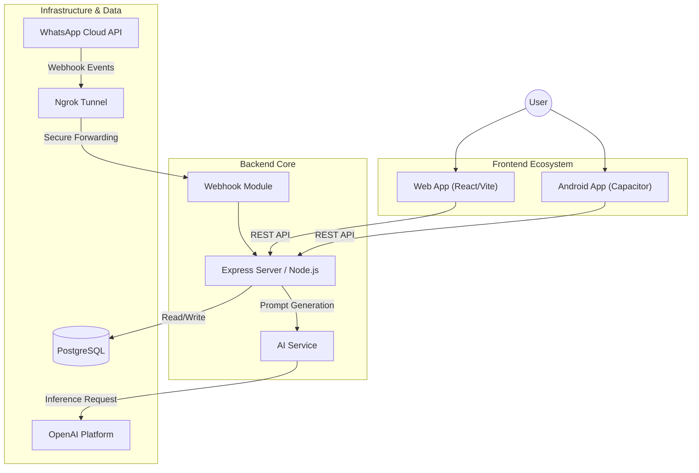

# 📘 Chat SummarAIzer: Official Technical Documentation

> **Version:** 1.0.1
> **Status:** Active Development
> **Tech Stack:** MERN Stack + Capacitor
> **Developer:** Pedro Liébana

---

## 1. Introduction

**Chat SummarAIzer** is an advanced technological solution designed for efficient WhatsApp communication management, for now. Its main objective is to synthesize large volumes of unread messages, transforming them into clear executive summaries, with a tone ranging from the most formal to somewhat humorous, at the user's discretion, using Generative Artificial Intelligence.

The system consists of a distributed architecture that includes a robust backend server, a modern web interface, and a native mobile application for Android, ensuring accessibility and performance. 

---

## 2. Technical Architecture

The project follows a modular architecture, clearly separating responsibilities between the client and the server.

### 2.1 Component Diagram



### 2.2 Technology Stack

| Component | Technology | Version | Description |
| :--- | :--- | :--- | :--- |
| **Backend** | **Node.js** | v18+ | JavaScript runtime environment. |
| | **Express.js** | v4.x | Framework for REST API and route handling. |
| | **PostgreSQL** | v15+ | Robust relational database. |
| **Frontend** | **React** | v18 | Component-based UI library. |
| | **Vite** | v5 | Ultra-fast build tool. |
| | **Tailwind CSS** | v3 | "Utility-first" styling framework. |
| | **Framer Motion** | v12 | Animation library for React. |
| | **react-markdown** | v9 | Markdown rendering engine. |
| | **Lucide React** | v0.292 | Icon library. |
| **Mobile** | **Capacitor** | v8 | Runtime for native web applications. |
| **DevOps** | **Ngrok** | - | Secure tunnel to expose localhost to the internet. |

---

## 3. API Specification (REST)

Below is the technical documentation of the main endpoints used in production.

### 3.1 Summary Generation

Critical endpoint that processes messages and returns the AI-generated summary.

*   **Route**: `/api/summary/generate`
*   **Method**: `POST`
*   **Authentication**: (Pending implementation)

#### Request Payload (`body`)

```json
{
  "contactIds": [12, 45],       // Array of Contact IDs (Integer)
  "timeRange": "unread",        // String: "unread" or number of hours (e.g. "24")
  "tone": "professional",       // String: "professional", "friendly", "humorous"
  "language": "es"              // String: ISO language code (optional)
}
```

#### Successful Response (`200 OK`)

```json
{
  "summary": "Summary generated in Markdown format..."
}
```

### 3.2 Contact List

Retrieves the list of active conversations available in the database.

*   **Route**: `/api/summary/contacts`
*   **Method**: `GET`
*   **Response**: Array of objects with `id`, `name`, `phone_number`, and metadata.
 
### 3.3 Client-Side Logic (State)

The application maintains a sophisticated client-side state manager to handle:
*   **Session History:** Summaries are cached locally in memory to allow instant review without re-fetching.
*   **Context Isolation:** History is filtered dynamically based on the selected contact ID, ensuring data privacy between views.

---

## 4. Configuration & Startup Guide

Follow these steps to set up the complete development environment.

### 4.1 Backend (Server)

The brain of the application, responsible for logic and database connection.

1.  Open a terminal in the project root folder.
2.  Navigate to the backend folder:
    ```bash
    cd backend
    ```
3.  Install dependencies (if running for the first time):
    ```bash
    npm install
    ```
4.  Start the server in development mode:
    ```bash
    npm run dev
    ```
    > **Note:** The server will listen on port `3000` by default. You will see a confirmation message in the console.

### 4.2 Frontend (Web Interface)

1.  Open a **new** terminal.
2.  Navigate to the frontend folder:
    ```bash
    cd frontend
    ```
3.  Install dependencies:
    ```bash
    npm install
    ```
4.  Start the application:
    ```bash
    npm run dev
    ```
    > **Access:** Generally available at `http://localhost:5173`.

### 4.3 Ngrok Configuration (Webhooks)

To allow WhatsApp to send messages to your local server (which does not have a public IP), we use Ngrok.

1.  **Install Ngrok**: Download and install from [ngrok.com](https://ngrok.com).
2.  **Start Tunnel**: In a new terminal, run the following command pointing to your backend port (3000):
    ```bash
    ngrok http 3000
    ```
    > **Note for Windows (PowerShell):** If you get an error saying the command is not found, try running `.\ngrok http 3000` from the folder where you downloaded ngrok.
3.  **Copy URL**: Ngrok will generate a secure public URL (e.g., `https://a1b2-c3d4.ngrok-free.app`).
4.  **Configure Meta**:
    *   Go to the Meta Developers Dashboard > WhatsApp > Configuration.
    *   Edit the Webhook configuration.
    *   **Callback URL**: Paste your Ngrok URL followed by `/api/webhook` (e.g., `https://.../api/webhook`).
    *   **Verify Token**: Enter the token you defined in your `.env` file.

### 4.4 Mobile Build (Android via Capacitor)

If you wish to deploy the mobile version:

1.  From the `frontend` folder:
    ```bash
    npm run build
    npx cap sync
    npx cap open android
    ```
2.  This will open Android Studio, where you can emulate the app or install it on a physical device.

---

## 5. Project Structure

A quick overview of how the code is organized.

```
whatsapp-summarizer/
├── backend/                # Node.js Server
│   ├── config/             # DB Configuration
│   ├── controllers/        # Endpoint Logic
│   ├── models/             # Database Models
│   ├── routes/             # API Route Definitions
│   ├── services/           # Complex Logic (OpenAI, etc.)
│   └── app.js              # Entry Point
├── frontend/               # React Client
│   ├── src/
│   │   ├── components/     # Reusable UI Components
│   │   ├── services/       # API Calls (Axios)
│   │   ├── config.js       # App Configuration
│   │   ├── translations.js # UI Translations
│   │   └── App.jsx         # Main Component
│   ├── android/            # Generated Native Project
│   └── capacitor.config.json
└── docs/                   # Project Documentation
```

---

© 2026 Chat SummarAIzer. All rights reserved.
