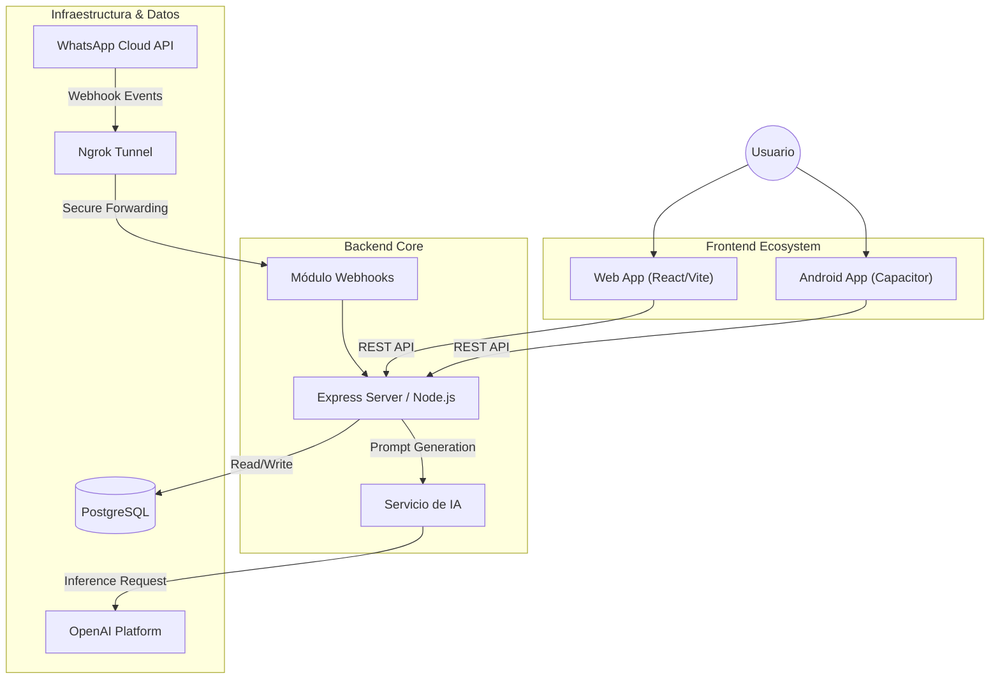

# 📘 Chat SummarAIzer: Documentación Técnica Oficial

> **Versión:** 1.0.1
> **Estado:** En Desarrollo Activo
> **Tecnología:** MERN Stack + Capacitor
> **Desarrollador:** Pedro Liébana

---

## 1. Introducción

**Chat SummarAIzer** es una solución tecnológica avanzada diseñada para la gestión eficiente de comunicaciones en, por ahora, WhatsApp. Su objetivo principal es sintetizar grandes volúmenes de mensajes no leídos, transformándolos en resúmenes claros, con un tono que va desde lo más formal hasta algo humorístico, a elección del usuario, mediante Inteligencia Artificial Generativa.

El sistema se compone de una arquitectura distribuida que incluye un servidor backend robusto, una interfaz web moderna y una aplicación móvil nativa para Android, garantizando accesibilidad y rendimiento. 

---

## 2. Arquitectura Técnica

El proyecto sigue una arquitectura modular separando claramente las responsabilidades entre el cliente y el servidor.

### 2.1 Diagrama de Componentes



### 2.2 Stack Tecnológico

| Componente | Tecnología | Versión | Descripción |
| :--- | :--- | :--- | :--- |
| **Backend** | **Node.js** | v18+ | Entorno de ejecución de JavaScript. |
| | **Express.js** | v4.x | Framework para la API REST y manejo de rutas. |
| | **PostgreSQL** | v15+ | Base de datos relacional robusta. |
| **Frontend** | **React** | v18 | Biblioteca UI basada en componentes. |
| | **Vite** | v5 | Herramienta de construcción ultrarrápida. |
| | **Tailwind CSS** | v3 | Framework de estilos "utility-first". |
| | **Framer Motion** | v12 | Biblioteca de animaciones para React. |
| | **react-markdown** | v9 | Motor de renderizado Markdown. |
| | **Lucide React** | v0.292 | Biblioteca de iconos. |
| **Mobile** | **Capacitor** | v8 | Runtime para aplicaciones web nativas. |
| **DevOps** | **Ngrok** | - | Túnel seguro para exponer localhost a internet. |

---

## 3. Especificación de API (REST)

A continuación, se detalla la documentación técnica de los endpoints principales utilizados en producción.

### 3.1 Generación de Resúmenes

Endpoint crítico que procesa los mensajes y retorna el resumen generado por IA.

*   **Ruta**: `/api/summary/generate`
*   **Método**: `POST`
*   **Autenticación**: (Pendiente de implementación)

#### Payload del Request (`body`)

```json
{
  "contactIds": [12, 45],       // Array de IDs de contactos (Integer)
  "timeRange": "unread",        // String: "unread" o número de horas (ej: "24")
  "tone": "professional",       // String: "professional", "friendly", "humorous"
  "language": "es"              // String: Código ISO de idioma (opcional)
}
```

#### Respuesta Exitosa (`200 OK`)

```json
{
  "summary": "Resumen generado en formato Markdown..."
}
```

### 3.2 Listado de Contactos

Recupera la lista de conversaciones disponibles en la base de datos.

*   **Ruta**: `/api/summary/contacts`
*   **Método**: `GET`
*   **Respuesta**: Array de objetos con `id`, `name`, `phone_number` y metadatos.

### 3.3 Lógica del Cliente (Estado)

La aplicación mantiene un sofisticado gestor de estado en el cliente para manejar:
*   **Historial de Sesión:** Los resúmenes se almacenan en caché local (memoria) para permitir revisión instantánea sin recargas.
*   **Aislamiento de Contexto:** El historial se filtra dinámicamente basado en el ID del contacto seleccionado, asegurando privacidad de datos entre vistas.

---

## 4. Guía de Configuración e Inicio

Sigue estos pasos para levantar el entorno de desarrollo completo.

### 4.1 Backend (Servidor)

El cerebro de la aplicación, encargado de la lógica y conexión con la base de datos.

1.  Abre una terminal en la carpeta raíz del proyecto.
2.  Navega a la carpeta del backend:
    ```bash
    cd backend
    ```
3.  Instala las dependencias (si es la primera vez):
    ```bash
    npm install
    ```
4.  Inicia el servidor en modo desarrollo:
    ```bash
    npm run dev
    ```
    > **Nota:** El servidor escuchará por defecto en el puerto `3000`. Verás un mensaje en consola confirmándolo.

### 4.2 Frontend (Interfaz Web)

1.  Abre una **nueva** terminal.
2.  Navega a la carpeta del frontend:
    ```bash
    cd frontend
    ```
3.  Instala las dependencias:
    ```bash
    npm install
    ```
4.  Inicia la aplicación:
    ```bash
    npm run dev
    ```
    > **Acceso:** Generalmente disponible en `http://localhost:5173`.

### 4.3 Configuración de Ngrok (Webhooks)

Para que WhatsApp pueda enviar mensajes a tu servidor local (que no tiene IP pública), utilizamos Ngrok.

1.  **Instalar Ngrok**: Descarga e instala desde [ngrok.com](https://ngrok.com).
2.  **Iniciar Túnel**: En una nueva terminal, ejecuta el siguiente comando apuntando al puerto de tu backend (3000):
    ```bash
    ngrok http 3000
    ```
    > **Nota para Windows (PowerShell):** Si recibes un error diciendo que no se reconoce el comando, intenta ejecutar `.\ngrok http 3000` desde la carpeta donde descargaste ngrok.
3.  **Copiar URL**: Ngrok generará una URL pública segura (ej: `https://a1b2-c3d4.ngrok-free.app`).
4.  **Configurar Meta**:
    *   Ve al Panel de Desarrolladores de Meta > WhatsApp > Configuración.
    *   Edita la configuración del Webhook.
    *   **URL de devolución de llamada**: Pega tu URL de Ngrok seguida de `/api/webhook` (ej: `https://.../api/webhook`).
    *   **Token de verificación**: Introduce el token que definiste en tu archivo `.env`.

### 4.4 Compilación Móvil (Android via Capacitor)

Si deseas desplegar la versión móvil:

1.  Desde la carpeta `frontend`:
    ```bash
    npm run build
    npx cap sync
    npx cap open android
    ```
2.  Esto abrirá Android Studio, donde podrás emular la app o instalarla en un dispositivo físico.

---

## 5. Estructura del Proyecto

Una visión rápida de cómo está organizado el código.

```
whatsapp-summarizer/
├── backend/                # Servidor Node.js
│   ├── config/             # Configuración de BD
│   ├── controllers/        # Lógica de los endpoints
│   ├── models/             # Modelos de BD
│   ├── routes/             # Definición de rutas API
│   ├── services/           # Lógica compleja (OpenAI, etc.)
│   └── app.js              # Punto de entrada
├── frontend/               # Cliente React
│   ├── src/
│   │   ├── components/     # Componentes UI reutilizables
│   │   ├── services/       # Llamadas a la API (Axios)
│   │   ├── config.js       # Configuración de la App
│   │   ├── translations.js # Traducciones UI
│   │   └── App.jsx         # Componente principal
│   ├── android/            # Proyecto nativo generado
│   └── capacitor.config.json
└── docs/                   # Documentación del proyecto
```

---

© 2026 Chat SummarAIzer. Todos los derechos reservados.
