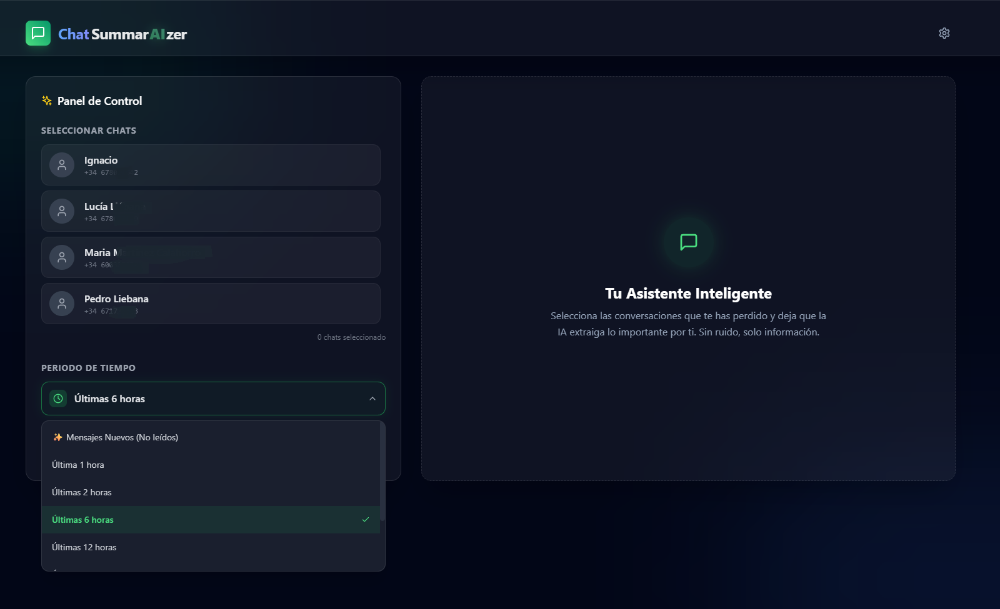
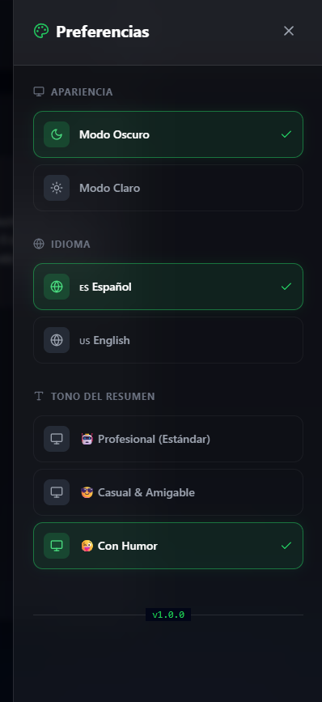
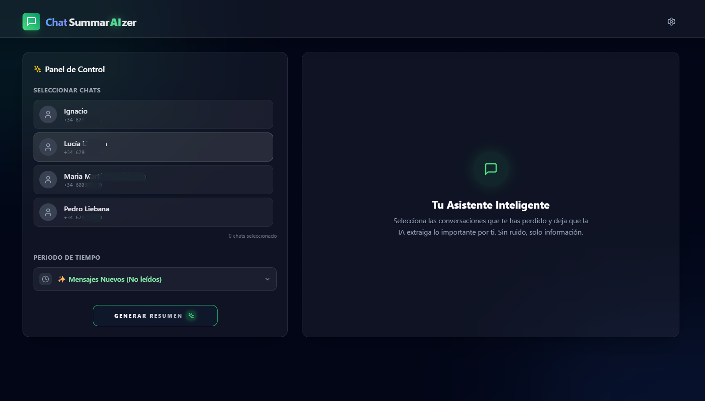
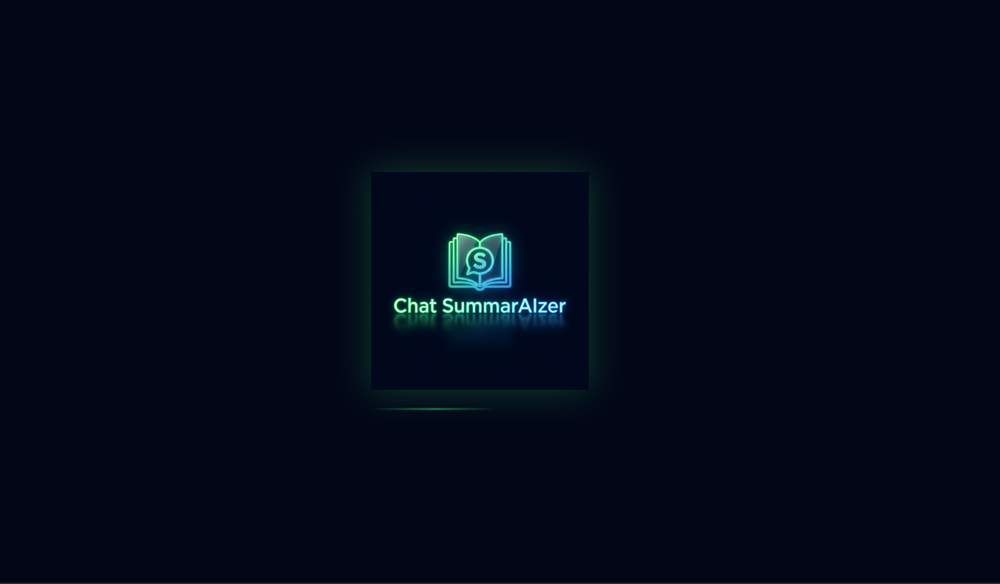
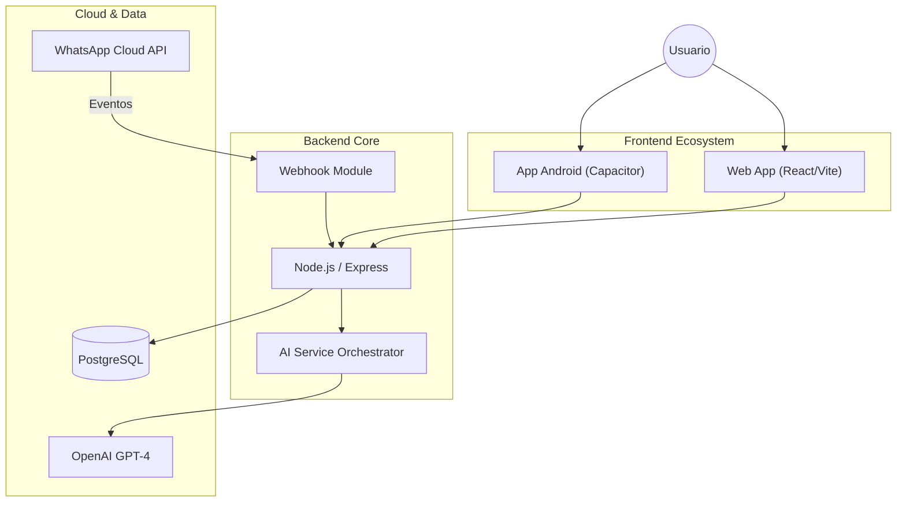
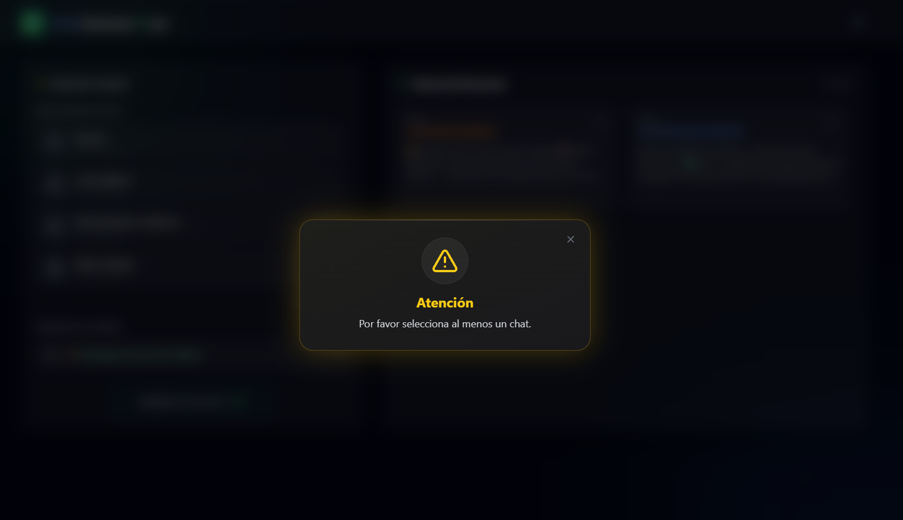
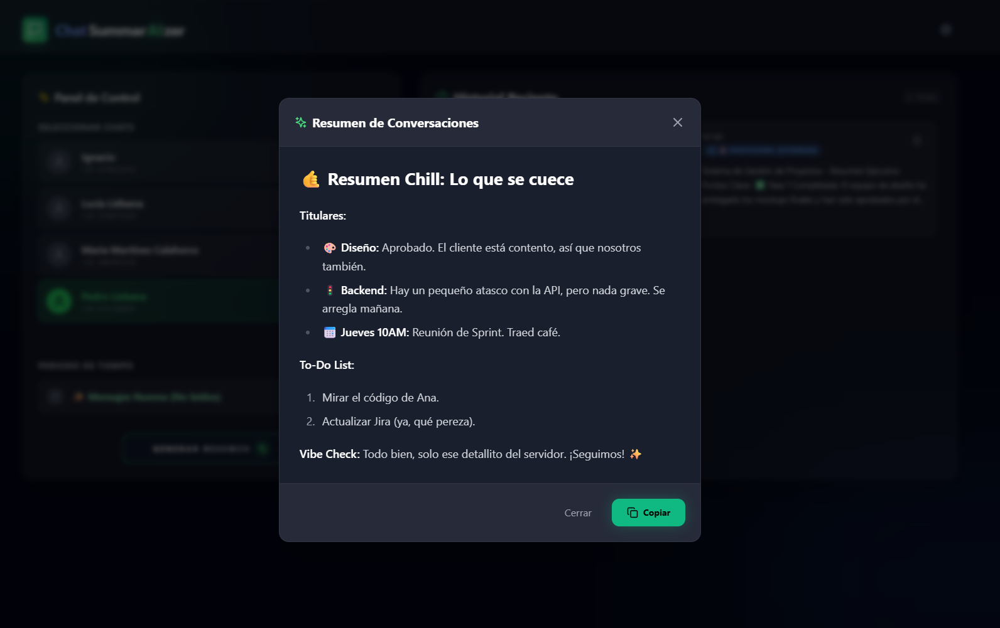
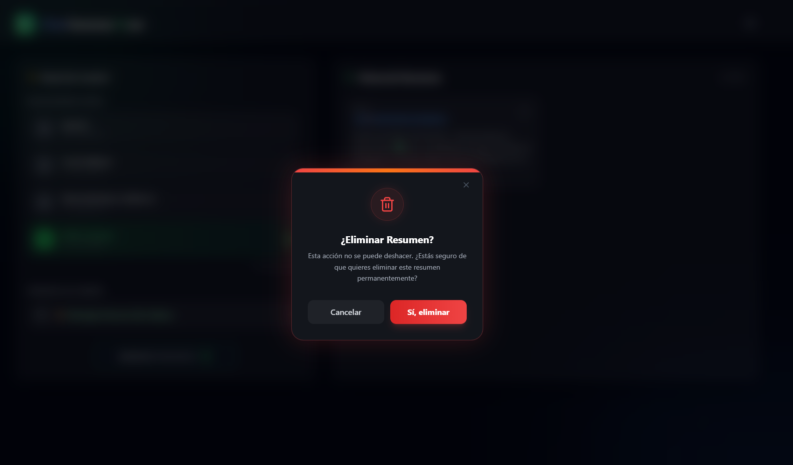
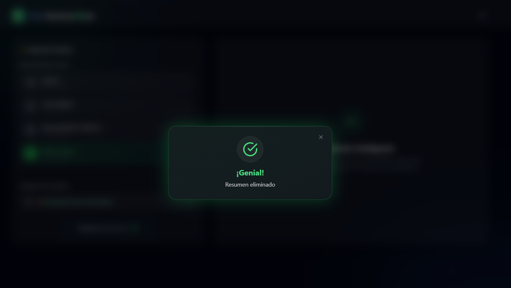

<h1 align="center">Chat SummarAIzer</h1>
<h3 align="center">Tu filtro cognitivo en la era del ruido digital.</h3>

<div align="center">
  <a href="Imagenes/logo.png">
    
  </a>
</div>

<br>

<div align="center">

[](https://opensource.org/licenses/MIT) [](https://github.com/pedroliebana/whatsapp-summarizer) [](https://reactjs.org/)

### ***La IA debe simplificar, no complicar. Chat SummarAIzer lo hace posible.*** ###

</div>

---

## 📋 Descripción General

**Chat SummarAIzer** es mucho más que una herramienta: es un aliado estratégico para optimizar tu tiempo y recuperar el control de tu atención. En un entorno digital dominado por notificaciones constantes y flujos interminables de mensajes, la aplicación actúa como un **filtro inteligente** capaz de analizar, comprender y sintetizar tus conversaciones de Apps de mensajería de forma eficiente.

Gracias al uso de Inteligencia Artificial Generativa, Chat SummarAIzer convierte cientos de mensajes no leídos en resúmenes ejecutivos claros y accionables, permitiéndote estar siempre al día sin la sobrecarga cognitiva ni la presión de leerlo todo.

---

## 💡 El Problema vs. La Solución

| El Problema | La Solución (Chat SummarAIzer) |
| :--- | :--- |
| **Ruido Digital:** Cientos de mensajes irrelevantes en grupos masivos. | **Síntesis Inteligente:** Extracción automática de los puntos clave y decisiones importantes. |
| **Ansiedad Social:** Miedo a perderse algo importante ("FOMO"). | **Deep Dive:** Modos de resumen que cubren desde mensajes no leídos, franjas horarias o semanas completas. |
| **Falta de Contexto:** Mensajes fragmentados difíciles de seguir. | **Contexto Persistente:** Historial de resúmenes que recuerda dónde te quedaste. |

---

## ✨ Características Principales

### 🧠 Motor de Resumen Multimodal - Inteligencia adaptada a tu marco temporal
<a href="Imagenes/timeslot.png">
  
</a>

Chat SummarAIzer te permite decidir qué analizar y hasta dónde retroceder, ajustando los resúmenes a tu contexto y disponibilidad:
*   **Mensajes no leídos** Obtén un resumen inmediato de todo lo que aún no has visto, sin perder información relevante.
*   **Franjas horarias personalizadas (1h · 24h · 72h):** Ideal para ponerte al día tras una reunión, una jornada laboral o varios días de desconexión.
*   **Resumen semanal (7 días)** Una visión completa y estructurada de la actividad más relevante de la semana.
<br clear="right"/>

### ✍️ Estilo de resumen inteligente
<a href="Imagenes/menu.png">
  
</a>

La IA adapta su voz según quién sea el remitente:
*   **👔 Profesional:** Resúmenes concisos, estructurados y orientados a la acción. Ideales para entornos laborales, equipos y comunicaciones formales.
*   **👋 Casual & Amigable:** Resúmenes con un enfoque más cercano y narrativo, pensados para conversaciones personales, familiares o informales.
*   **😄 Con humor:** Un estilo ligero y desenfadado que añade un toque creativo y humorístico a chats sociales o grupos informales, sin perder la información clave.
<br clear="right"/>

### 🎨 Diseño centrado en la experiencia
<a href="Imagenes/dashboard.png">
  
</a>

Chat SummarAIzer presenta una interfaz moderna y minimalista, construida con **Glassmorphism**, animaciones orgánicas y transiciones fluidas que refuerzan la sensación de ligereza y claridad.

Incluye un modo oscuro, cuidadosamente diseñado para reducir la fatiga visual y mejorar la legibilidad en entornos de uso prolongado o con poca luz.
<br clear="right"/>

### 🔒 Privacidad Primero
La privacidad es un pilar fundamental de Chat SummarAIzer. La aplicación implementa un modelo de procesamiento efímero de datos, en el que las conversaciones se analizan en tiempo real sin ser almacenadas de forma permanente.

El historial se gestiona exclusivamente a nivel local, garantizando que tus mensajes no queden registrados en servidores de inferencia una vez generado el resumen. Tú mantienes el control total sobre tu información, en todo momento.

---

## 📸 Galería Visual

<div align="center">
  <a href="Imagenes/splash.png">
    
  </a>
  <a href="Imagenes/grid.png">
    
  </a>
  <a href="Imagenes/resumen3.png">
    
  </a>
</div>

> *La interfaz se adapta fluidamente entre escritorio y dispositivos móviles gracias a una arquitectura responsive meticulosa.*

---

## 🏗️ Arquitectura Técnica

El sistema utiliza una arquitectura distribuida robusta, separando claramente el cliente, el servidor y los servicios de IA.



### Stack Tecnológico
*   **Frontend:** React 18, Vite, Tailwind CSS, Framer Motion.
*   **Backend:** Node.js, Express, PostgreSQL.
*   **Mobile:** Capacitor (Android).
*   **AI:** OpenAI API integración custom.
*   **Infra:** Ngrok (Dev Tunneling).

---

## 🚀 Roadmap

| Fase | Estado | Objetivo |
| :--- | :--- | :--- |
| **Fase 1: Foundation** | ✅ Completado | Integración WhatsApp, MVP Resúmenes, UI Glassmorphism. |
| **Fase 2: Intelligence** | 🚧 En Progreso | **Audio Transcription** (Whisper), Análisis de Sentimiento. |
| **Fase 3: Ecosystem** | 📅 Q3 2026 | Integración con Slack/Telegram, Edge AI (privacidad total). |

---

## 🛠️ Instalación y Configuración

Sigue estos pasos para desplegar el entorno de desarrollo local.

### Prerrequisitos
*   Node.js v18+
*   PostgreSQL
*   Cuenta de Meta Developers (WhatsApp API)
*   API Key de OpenAI

### 1. Backend
```bash
cd backend
npm install
# Crea un archivo .env basado en .env.example
npm run dev
# El servidor iniciará en puerto 3000
```

### 2. Frontend
```bash
cd frontend
npm install
npm run dev
# Accesible en http://localhost:5173
```

### 3. Configurar Webhooks (Ngrok)
Para recibir mensajes de WhatsApp en local:
```bash
ngrok http 3000
# Copia la URL generada y configúrala en el Dashboard de Meta
```

---

## 📖 Uso de la Aplicación

1.  **Pantalla de inicio (Splash Screen):** Al iniciar la aplicación, se muestra una pantalla de bienvenida con el logotipo de **Chat SummarAIzer**.
2.  **Dashboard principal:** Tras el inicio, el usuario accede a un dashboard limpio e intuitivo que muestra los contactos y grupos con actividad reciente. Desde esta vista es posible seleccionar cualquier conversación activa para su análisis.
3.  **Configuración del resumen:** Una vez seleccionada la conversación, el usuario puede definir el rango temporal del análisis (por ejemplo, Últimas 24 horas), ajustando el resumen a sus necesidades.

<div align="center">
  <a href="Imagenes/splash.png">
    
  </a>
  <a href="Imagenes/dashboard.png">
    
  </a>
  <a href="Imagenes/timeslot.png">
    
  </a>
</div>

4.  **Menú de preferencias:** La aplicación incluye un menú de configuración donde es posible personalizar la experiencia con: modo claro y oscuro, idioma de la interfaz y tono de redacción del resumen (Profesional, Casual & Amigable o Con humor)
5.  **Warning:** Si el usuario intenta generar un resumen sin haber seleccionado previamente una conversación, el sistema muestra un aviso informativo, guiando correctamente el flujo de uso.
6.  **Resumen en estilo Profesional (estándar):** Ejemplo de resumen generado con un estilo conciso, estructurado y orientado a la acción, pensado para contextos laborales o formales.

<div align="center">
  <a href="Imagenes/menu.png">
    
  </a>
  <a href="Imagenes/warning.png">
    
  </a>
  <a href="Imagenes/resumen3.png">
    
  </a>
</div>

7.  **Resumen en estilo Casual & Amigable:** Ejemplo de resumen con un enfoque más cercano y narrativo, ideal para conversaciones personales o informales.
8.  **Resumen en estilo Con humor:** Ejemplo de resumen con un tono ligero y creativo, diseñado para grupos sociales o chats distendidos, manteniendo siempre la información clave.
9.  **Historial de resúmenes:** La aplicación dispone de un historial donde se muestran todos los resúmenes generados, indicando el estilo aplicado. Desde esta sección, los resúmenes pueden volver a consultarse o eliminarse.

<div align="center">
  <a href="Imagenes/resumen2.png">
    
  </a>
  <a href="Imagenes/resumen3.png">
    
  </a>
  <a href="Imagenes/grid.png">
    
  </a>
</div>

10.  **Eliminación de resúmenes:** Al borrar un resumen, el sistema solicita confirmación explícita mediante un mensaje de alerta. Tras la eliminación, se muestra una notificación de confirmación para garantizar una experiencia clara y segura.

<div align="center">
  <a href="Imagenes/delete.png">
    
  </a>
  <a href="Imagenes/deleteresume.png">
    
  </a>
</div>

---

## 📊 Presentación del proyecto

A continuación muestro una presentación en html de **Chat SummarAIzer** la cual ofrece, de manera visual y conceptual el producto, diseñada para complementar la información descrita en este README.

Apoyada en elementos visuales y directos, es el punto de entrada ideal para comprender rápidamente el valor del proyecto sin necesidad de profundizar en todos los detalles técnicos.

Disponible en los siguientes idiomas:

- 🇪🇸 [Presentación en Español](https://castellano46.github.io/Chat-SummarAIzer/presentation/presentation_es.html)
- 🇬🇧 [Presentation in English](https://castellano46.github.io/Chat-SummarAIzer/presentation/presentation_en.html)

**Desarrollado con ❤️ por Pedro Liébana**
*© 2026 Chat SummarAIzer. Todos los derechos reservados.*
